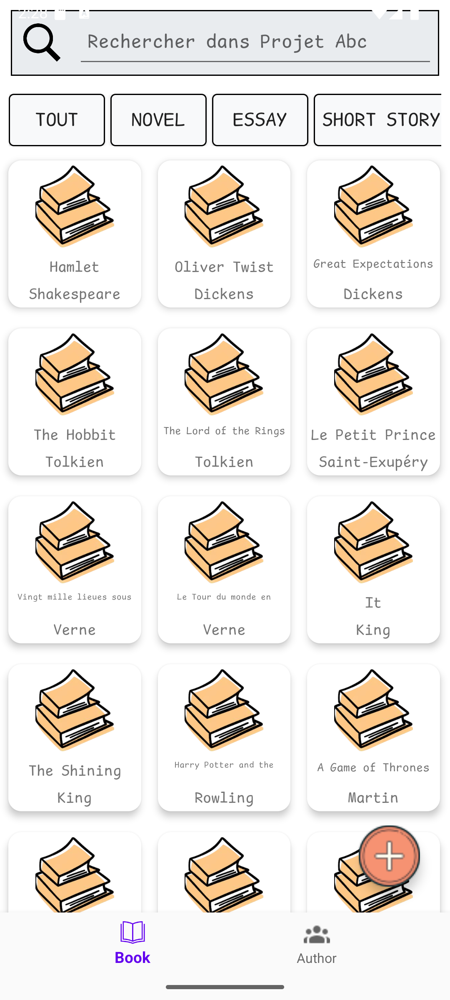
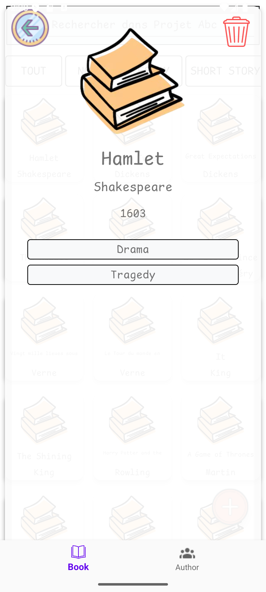
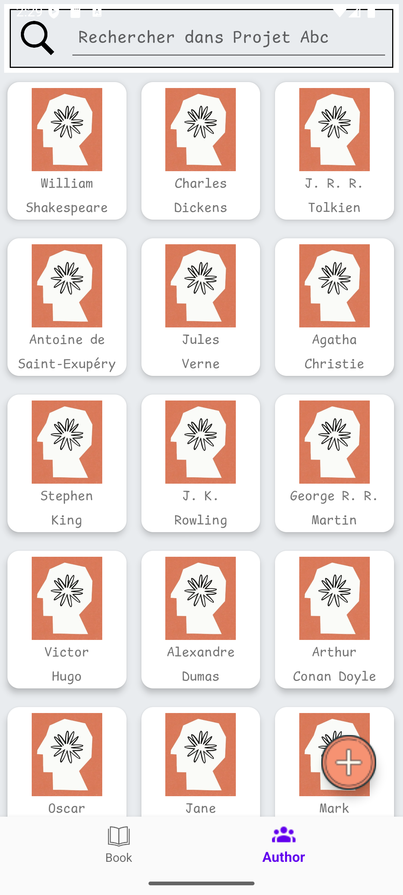
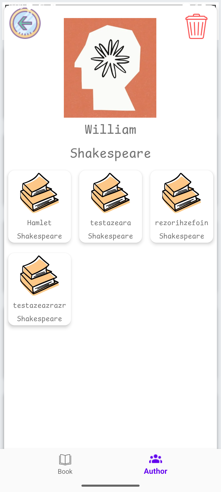
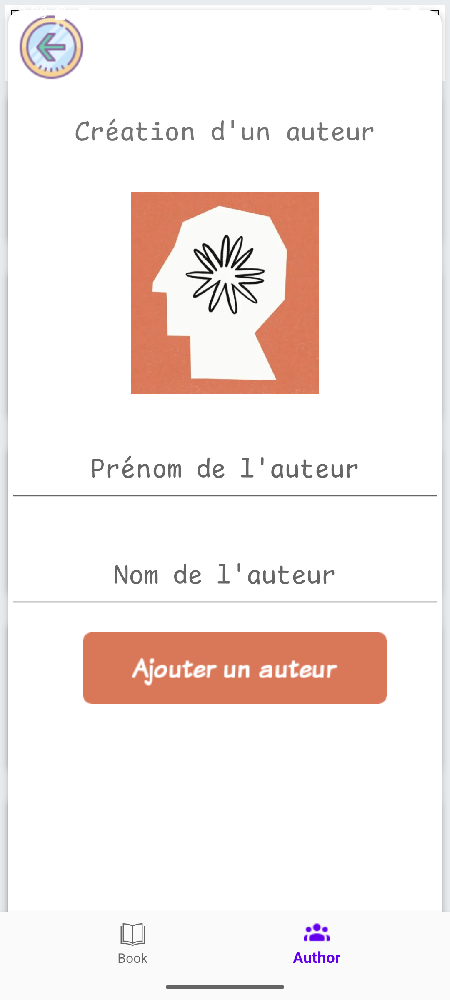

# Projet ABC - Android Books Client

## Sommaire

1. [**Introduction**](#introduction)

   - [Contexte et objectifs du projet](#contexte-et-objectifs-du-projet)

2. [**Organisation**](#organisation)

   - [Distribution des tâches](#distribution-des-tâches)
   - [Organisation (Méthode Kanban)](#organisation-méthode-kanban)

3. [**Informations sur l'installation et notre architecture**](#informations-sur-linstallation-et-notre-architecture)

   - [Installation](#installation)
     - [Étape 1 : Installation API-Web (Windows / Linux)](#étape-1)
     - [Étape 2 : Ouverture du projet sous Android Studio](#étape-2)
   - [Architecture](#architecture)
     - [Définition de l'architecture MVVM](#architecture)
     - [Organisation des fichiers](#architecture)
     - [Gestion des auteurs et livres](#architecture)

4. [**Difficultés et fonctionnalités**](#difficultés-et-fonctionnalités)
   - [Difficultés](#difficultés)
   - [Fonctionnalités (Incluant Bonus)](#fonctionnalités)

# Introduction

## Contexte et objectifs du projet

Le projet Android Books Client consiste à développer une application mobile permettant d’interagir avec une API de gestion de livres (développée en TypeScript avec Express et Prisma). L’objectif principal est de proposer une interface utilisateur intuitive qui facilite la consultation, la création et la suppression de livres et d’auteurs.

  
  
  
  
  

L’application doit notamment :

- **Afficher des listes** : une liste des livres et une liste des auteurs, chacune présentée de manière claire et accessible via des composants comme le RecyclerView.

- **Afficher les détails** : lors de la sélection d’un élément (livre ou auteur), l’application doit afficher les informations détaillées correspondantes, incluant des éléments comme la description et les tags pour les livres, ou la liste des ouvrages pour un auteur.

- **Créer et supprimer** : offrir des formulaires pour la création de nouveaux livres et auteurs, ainsi que des options pour supprimer ces éléments directement depuis leur fiche de détail.

# Organisation

## Distribution des tâches

La distribution et le temps de travail sont équivalents (50%-50%).

## Organisation

Nous avons suivi une méthode Kanban (Agile) avec une planification des tâches et une date limite qui correspond à celle du projet.

# Informations sur l'installation et notre architecture

## Installation

### Étape 1

- Windows (PowerShell) : `git clone git@github.com:LeDesert/AndroidBooksClient.git`

  - Puis allez dans `./p42-abc/API-Web/books`
  - Exécutez `npm.cmd install`
  - Enfin, lancez `npm.cmd run dev`

- Linux (LinuxShell) : `git clone git@github.com:LeDesert/AndroidBooksClient.git`
  - Puis allez dans `./p42-abc/API-Web/books`
  - Exécutez `npm install`
  - Enfin, lancez `npm run dev`

### Étape 2

- Windows & Linux : Ouvrez le projet sous Android Studio. Utilisez le Medium Phone (6.4 1080x2400 420dpi) sous VanillaIceCream (Android 15.0 x86_64).

## Architecture

Nous avons respecté l'architecture MVVM (Model, View, ViewModel).

Instant définition ([source](https://angular.fr/get_started/mvvm)) :

- L'architecture MVVM (Model-View-ViewModel) est une approche de conception logicielle qui vise à séparer les données d'une application (le modèle) de sa présentation (la vue). Le ViewModel est une sorte de pont entre le modèle et la vue, il fournit une interface que la vue peut utiliser pour accéder aux données du modèle de manière appropriée. Cette architecture permet de rendre les vues plus indépendantes du modèle, ce qui facilite la maintenance et l'évolution de l'application.

Notre application est basée sur une Bottom Navigation Activity. Nous avons aussi adopté la méthode `feature-based` pour notre arborescence de fichiers. Cela signifie qu'un package correspond à une fonctionnalité.

Bien que pour Retrofit, un seul fichier d'interface API soit requis, nous avons décidé de les séparer dans des packages différents : `author/retrofit` pour les auteurs et `book/retrofit` pour les livres. Nous avons trouvé cette organisation plus propre et elle permet une refactorisation du code plus simple si nécessaire.

Les auteurs et livres ne sont pas stockés dans des `JSONArray` classiques. Nous avons des class `XXXResponseBody` qui permettent de manipuler des classes Java et non des `JSONArray` (ce qui améliore la lisibilité du code et facilite son évolution).

# Difficultés et fonctionnalités

## Difficultés

- Nous avons rencontré une difficulté majeure : le rafraîchissement du fragment principal lors de la suppression d’un auteur ou d’un livre. Nous avions tout essayé, de détacher le fragment et de le rattacher par la suite. Finalement, nous avons décidé d'utiliser des `Bundle` qui, lors de la fermeture du fragment, passent un booléen à `true` dans les fragments d'affichage d'un livre ou d'un auteur. Cela permet au fragment principal, grâce à un listener, de détecter qu'un élément a été supprimé et d’actualiser son `RecyclerView`.

- Dans le fragment d'un auteur (après un clic sur un auteur), nous n'arrivions pas à utiliser correctement la pile de fragments (`popStack`). Nous avons donc décidé de détruire systématiquement le fragment avec cette ligne : `getParentFragmentManager().beginTransaction().remove(this).commit();`

## Fonctionnalités

Toutes les fonctionnalités demandées ont été implémentées, ainsi que quelques bonus.

- **Bonus** :
  - Ajout d’une `SearchBar` pour rechercher un **livre** par son **nom**.
  - Ajout d’une `SearchBar` pour rechercher un **auteur** par son **nom**.
  - Filtrage par **tags** sur une barre de défilement horizontale.
  - Affichage de chaque élément dans une `CardView` grâce à une dépendance Gradle : `implementation(libs.cardview)`.
  - Ajout d'une image lors du chargement de l'application et d'une icône sur le "bureau"
